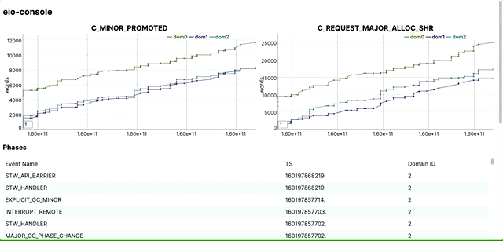

eio-console
-----------

*Status: Very, very experimental & WIP*

<p style="text-align: center;">
    
</p>

With the upcoming release of OCaml 5, OCaml programs will have built-in parallelism and the ability to offer direct-style concurrency using effects like that provided by [Eio][].

Providing tools to introspect and debug these programs is crucial. Along with domains and effects, OCaml 5 also has a new profiling tool called [Runtime Events](https://github.com/ocaml/ocaml/pull/10964). This is an efficient, always-on tool for profiling *live* OCaml programs. Currently, it does not support custom events.

Eio-console provides an application for monitoring running programs. This works in the browser, communicating information over a websocket. It could be extended to run directly in the terminal using [nottui](https://github.com/let-def/lwd).

**Note that currently, eio-console does not show anything related to Eio specifically. This will be possible if and when custom events are added to the runtime events library. For now, eio-console shows information for generic counters, phases and lifecycle events**.

## Installation

In this pre-OCaml 5 world, installation is not easy.

```
# After cloning this repository and checking out the submodule, create a 5.0.0 switch
opam update
# Add the alpha repository to get unreleased 5.0.0 compatible libraries
opam switch create 5.0.0+trunk --repo=default,alpha=git+https://github.com/kit-ty-kate/opam-alpha-repository.git
```

Finally you can install the dependencies for the project. 

```
opam pin . -yn
opam install . --deps-only --with-test
```

Hopefully that will get all of the necessary dependencies so you can run `dune build`.

## Usage

To use eio-console right now, it only supports monitoring a single eventring that you must specify. First, you have to run some program with eventring enabled. The executables in the `test` directory can be used for this (or any OCaml program that you can compile!):

```
OCAML_RUNTIME_EVENTS_START=1 _build/default/test/fib.exe 2 50
```

This will run the program and there should be a `<pid>.events` file in the directory that you ran the program from. You can then run

```
dune exec -- src/server/main.exe <pid>.events
```

and navigate to http://localhost:8080 to see the dashboard.


## Bindings

The `bindings` directory contains partial jsoo bindings to various JavaScript libraries which are themselves vendorered statically. See the directories for the various the licenses for those libraries.

[Eio]: https://github.com/ocaml-multicore/eio
